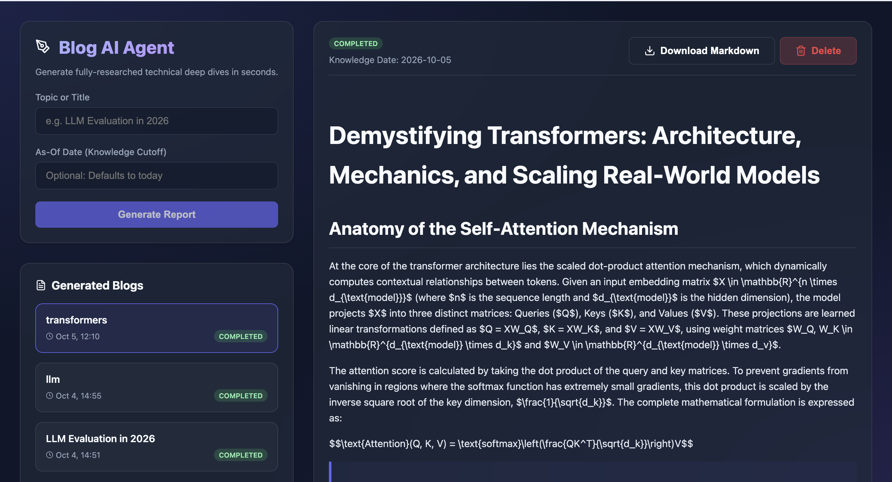
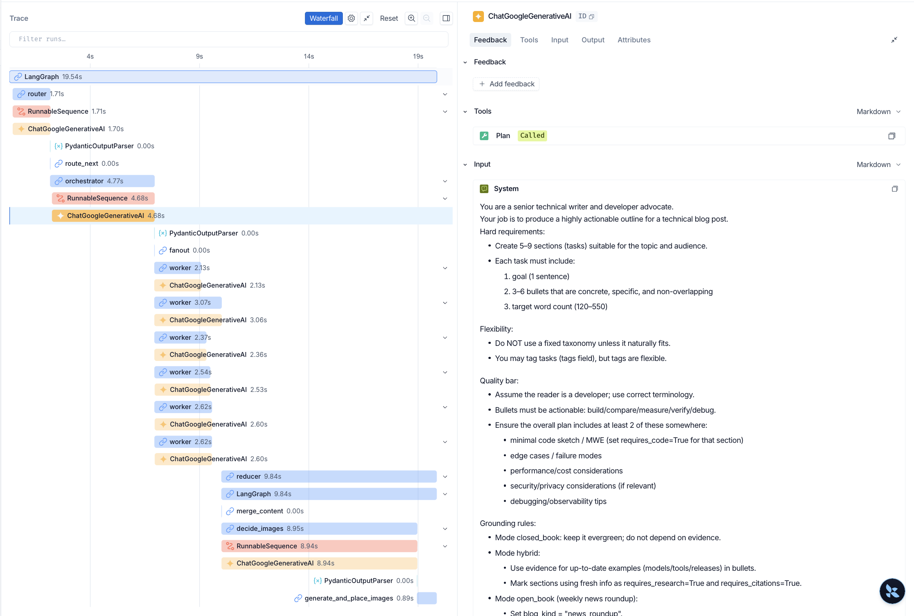

# 🧠 Agentic AI Blog Writer

An autonomous, multi-agent AI system that researches, writes, and publishes fully comprehensive, technical blog posts with AI-generated images. Built with LangGraph, this system mimics a real-world editorial team by dividing complex tasks into specialized AI nodes.

🔗 **Live Website**: [https://blog-agent-frontend-fjf8.onrender.com/](https://blog-agent-frontend-fjf8.onrender.com/)  
🐙 **GitHub Repository**: [https://github.com/yashh2417/blog-writing-agent](https://github.com/yashh2417/blog-writing-agent)  
🐳 **Docker Images**: Hosted on Docker Hub (Automated via GitHub Actions CI/CD)

---

## 📸 Screenshots

### 💻 User Interface



---

## 🤖 The AI Brain (`blog-agent` Deep Dive)
The core of this project is a state-of-the-art **Agentic AI Workflow** built using **LangGraph**. Unlike traditional conversational AI (like ChatGPT) that generates a single response to a single prompt, this agent utilizes a multi-node, cyclic graph architecture. It autonomously plans, executes, verifies, and iterates on the content without human intervention.

### Multi-Agent Node Architecture
The graph is designed as a state machine where a central `State` dictionary is passed and mutated by specialized nodes:

1. **Router Node (`router_node`)**: The intelligent entry point. It receives the user's raw topic and a knowledge cutoff date. It decides the optimal research strategy (e.g., deep technical dive, general overview, trending news) and determines how recent the evidence needs to be.
2. **Orchestrator Node (`orchestrator_node`)**: The Project Manager. Based on the router's decision, it generates a comprehensive, multi-step execution plan. It breaks the blog down into specific sections (Introduction, Technical Details, Conclusion, etc.) and assigns exact tasks to the writing workers.
3. **Research Node (`research_node`)**: The Investigator. This node breaks out to the internet using the **Tavily Search API** to scour the web for up-to-date, factual information. It compiles an "Evidence Pack" to ground the LLM in reality, completely eliminating AI hallucinations and ensuring citations.
4. **Worker Node (`worker_node`)**: The specialized Writer. It iterates through the orchestrator's plan, taking the researcher's raw evidence and drafting highly polished markdown content section by section.
5. **Image Generation Sub-Graph (`decide_images` & `generate_and_place_images`)**: The Art Director. It reads the finalized text, identifies optimal locations for visual aids to break up the text, and generates targeted image prompts. It uses **Gemini 2.5 Flash Lite** to create the images, uploads them directly to a **Supabase Storage Bucket**, and injects the live cloud URLs seamlessly into the markdown.
6. **Merge Node (`merge_content`)**: The Editor. It synthesizes all parallel worker outputs and images into one cohesive, beautifully formatted Markdown document ready for the user.

### 🔍 LangSmith Integration (Observability)
The entire `blog-agent` workflow is deeply integrated with **LangSmith**. Because an agentic workflow involves hundreds of sub-calls, LangSmith acts as the X-Ray for the AI:
* **Trace Trees:** Every execution is logged as a visual tree, showing exactly how much time each node took and what data was passed between them.
* **Token Tracking:** Monitors token usage across all LLM calls.
* **Debugging:** If a blog fails to generate perfectly, LangSmith allows us to see exactly which node (e.g., the Researcher failing to find a link, or the Orchestrator creating a bad plan) caused the issue.



---

## ⚙️ The Backend API
The backend acts as a highly concurrent bridge between the React frontend and the LangGraph agent. It is built in Python using **FastAPI** and **PostgreSQL (Supabase)**. 

To prevent the server from blocking while the AI spends 60+ seconds writing a blog, the backend utilizes **FastAPI Background Tasks**.

### API Endpoints
* `POST /api/blogs` - Initializes a new blog generation request and kicks off the LangGraph agent as a background task. Returns a status of `generating`.
* `GET /api/blogs` - Retrieves the history and statuses of all generated blogs from the database.
* `GET /api/blogs/{blog_id}` - Retrieves the full Markdown content and metadata for a specific blog.
* `GET /api/blogs/{blog_id}/download` - Serves the generated Markdown file as a downloadable attachment.
* `DELETE /api/blogs/{blog_id}` - Deletes the blog record from the PostgreSQL database, and crucially, runs a cascading cleanup script to delete the associated generated images from the Supabase Storage Bucket to prevent orphan files.

---

## 🎨 The Frontend UI
A lightweight, modern User Interface to interact with the AI.
* Built with **React** & **Vite** (TypeScript).
* Polling mechanism built-in to smoothly update the UI state from "Generating..." to "Completed" as the background agent works.
* Uses **React Markdown** and **SyntaxHighlighter** to beautifully render the AI's output directly in the browser, complete with code blocks, typography, and inline generated images.

---

## 🛠️ Local Installation & Usage (Docker)

You can easily spin up the entire Agentic AI system on your local machine using Docker Compose.

### 1. Clone the repository
```bash
git clone https://github.com/yashh2417/blog-writing-agent.git
cd blog-writing-agent
```

### 2. Configure Environment Variables
Create a `.env` file in the root directory and add your API keys:
```env
# AI Models & Tools
GOOGLE_API_KEY=your_gemini_api_key
TAVILY_API_KEY=your_tavily_search_api_key

# Database & Storage (Supabase)
DATABASE_URL=your_postgresql_connection_string
SUPABASE_URL=your_supabase_project_url
SUPABASE_KEY=your_supabase_service_role_key

# Optional: LangSmith Observability
LANGCHAIN_TRACING_V2=true
LANGCHAIN_ENDPOINT=https://api.smith.langchain.com
LANGCHAIN_API_KEY=your_langsmith_api_key
LANGCHAIN_PROJECT=blog-writing-agent

# Frontend Configuration
VITE_API_URL=http://localhost:8000/api/blogs
ALLOWED_ORIGINS=http://localhost:5173
```

### 3. Run with Docker Compose
Ensure you have [Docker Desktop](https://www.docker.com/products/docker-desktop) installed and running, then execute:
```bash
docker-compose up --build
```

The application will now be live on your machine!
* **Frontend UI**: [http://localhost:5173](http://localhost:5173)
* **Backend API Docs**: [http://localhost:8000/docs](http://localhost:8000/docs)

---

## 🚀 CI/CD & Deployment Architecture
This project is fully automated using modern DevOps practices:
1. **GitHub Actions**: A custom `.github/workflows/deploy.yml` automatically triggers on every push to the `main` branch.
2. **Docker Hub**: The pipeline builds isolated Docker images for both the frontend (`Dockerfile.frontend`) and backend (`Dockerfile.backend`) and pushes them directly to Docker Hub.
3. **Render**: Utilizing Render Deploy Hooks, the pipeline instantly notifies Render upon a successful build. Render then pulls the new Docker images and deploys them to the live environment. (The frontend is served blazingly fast using a custom Nginx configuration).

---

## 📬 Contact & Links

Developed by **Yash**. Feel free to reach out or connect!

* 🐙 **GitHub**: [yashh2417](https://github.com/yashh2417)
* 💼 **LinkedIn**: [Yash's LinkedIn](https://www.linkedin.com/in/yashh2417/)
* ✉️ **Email**: [yashh2417@gmail.com](mailto:yashh2417@gmail.com)
